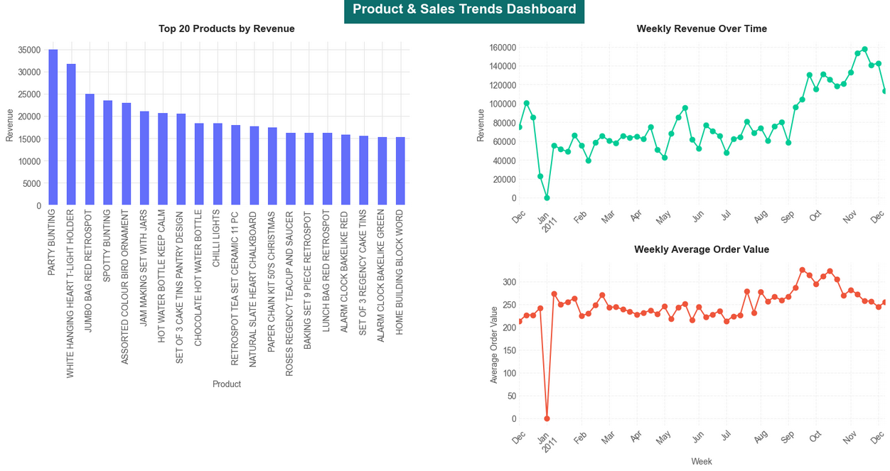

# E-commerce-Analysis
E-commerce data analysis project: used Python to clean, analyze, and visualize e-commerce data.

**Project Purpose/Objective:**
Analyzed a Kaggle e-commerce dataset of over 540,000 transaction records to extract actionable business insights, including top-selling products, seasonal sales trends, and customer spending behavior, in order to inform inventory, marketing, and pricing strategies.

**E-Commerce Sales Data Analysis & Product Trends Dashboard:**

**Dashboard Overview Snapshot:**
-	Top Products by Revenue: Bar chart highlighting the highest revenue-generating items.
- Weekly Revenue Over Time: Line chart revealing seasonal patterns and sales peaks.
- Weekly Average Order Value: Line chart showing customer spending per order.

**Key Insights for Stakeholders:**
1. Product Performance
-	The Top 20 products contribute a significant portion of total revenue, with “PARTY BUNTING” leading by a wide margin.
-	Prioritizing inventory and promotions on these high-revenue products can maximize profitability and reduce holding costs.
-	Products with consistently high revenue indicate steady customer demand, supporting supply chain planning.

2. Seasonal Sales Trends
- Weekly revenue shows clear seasonal fluctuations, peaking in November–December and dipping in early months.
- Early-year dips highlight slow periods or post-holiday declines, which is important for staffing and marketing campaigns.
- These trends enable optimized inventory management and targeted promotional timing.

3. Customer Spending Behavior
- Weekly average order value remains relatively stable, typically between 200–300 currency units.
- Minor spikes align with promotions or holidays, indicating customer responsiveness to targeted campaigns.
- Stability suggests most customers maintain consistent purchase sizes; initiatives like bundling or upselling could boost revenue.
  
4. Cancelled Orders & Outlier Handling
- Negative quantities correlated with invoice IDs starting with “C”, confirming cancellations or returns.
- Cancelled orders were separated into a dedicated dataframe (df_cancelled), ensuring that analysis of active sales is not skewed.
- Outliers in Quantity and Unit Price were removed from the active dataset (df_active) using the IQR method, improving accuracy of the dashboards and insights.

**Data Cleaning & Preprocessing:**
- Converted columns to appropriate types and inspected summary statistics.
- Removed nulls and duplicates to ensure data integrity.
- Performed feature engineering to create revenue, stock code length, and cancelled items columns.  Stock code length and cancelled items columns were used to for data cleaning to detect anomalous stock codes and identify invoice IDs starting with “C” that indicate cancelled transactions
- Filtered anomalous stock codes and removed rows with zero or negative Unit Price.
- Separated cancelled orders into df_cancelled and retained active orders in df_active for analysis.
- Removed outliers in Quantity and Unit Price using the IQR method in the active dataset.
- Boxplots were used to inspect distributions before and after cleaning.

**Dataset & Tools:**
- Dataset: Kaggle retail transactions (540,000+ rows)
- Tools: Python, Pandas for data processing; Matplotlib for visualization

**How to Run:**
1. Install required libraries: pandas, matplotlib, and plotly.
2. Open the notebook in Jupyter Notebook.
3. Run all cells to reproduce the data cleaning, analysis, and dashboards.
